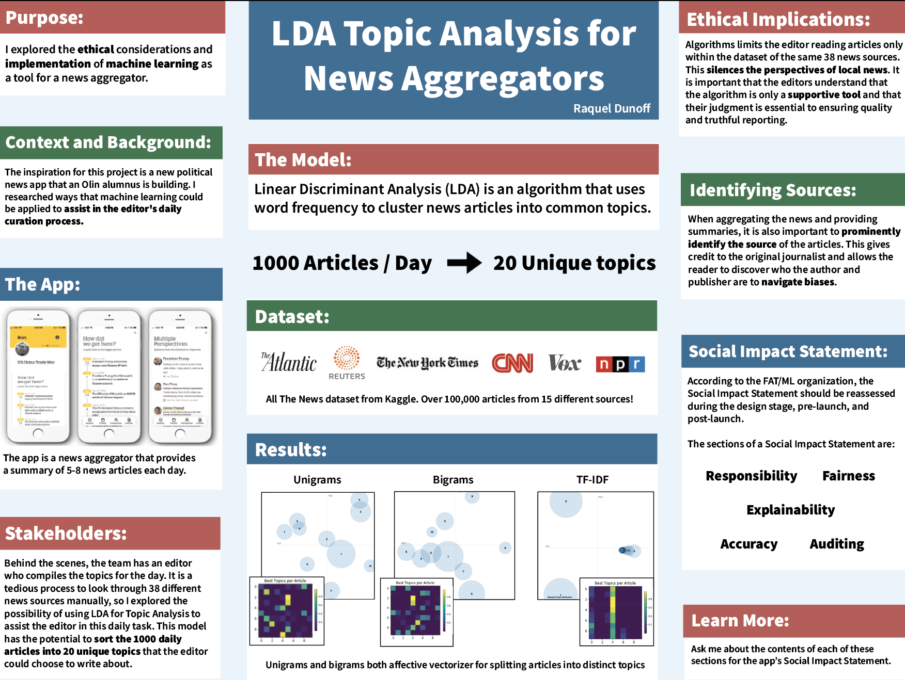

# LDATopicAnalysis
I explored Natural Language Processing by using Linear Disciminant Analysis on news articles to sort the by topic.

For my Machine Learning final, I created both a demo implementation of using LDA for topic analysis and created ethical guidelines for using the algorithm in the context of a news aggregator app. 

[Social Impact Statement](SocialImpactStatement.md)

[Implementation Co-Lab Notebook](LDATopicAnalysis.ipynb)

